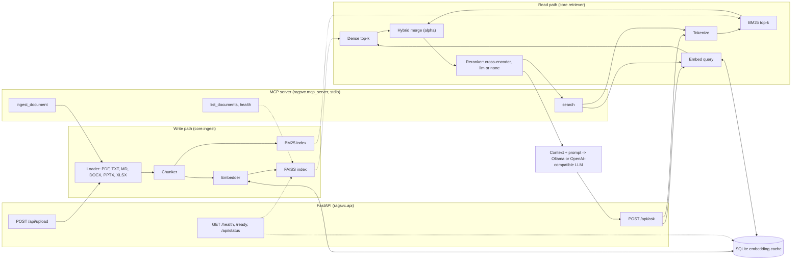

Forked from https://github.com/weiwill88/Local_Pdf_Chat_RAG.

# RecallMCP

A local-first retrieval service with two interfaces over one core: a
FastAPI API and an MCP server (stdio) over pluggable embeddings, FAISS +
BM25 hybrid retrieval and optional cross-encoder reranking, with an SQLite
embedding cache, health and readiness probes, request ids and JSON access
logs. Everything runs on CPU. The deterministic hash embedder needs
no model download, so the tests, the demo and the container image work
offline; the sentence-transformers embedder is an opt-in extra. Answer
generation uses a local Ollama server or any OpenAI-compatible endpoint
and is optional: upload and retrieval work without an LLM.

[](https://github.com/vipul21435/recallmcp/actions/workflows/ci.yml)
[](LICENSE)
[](https://www.python.org/)

This repository is a fork of
[weiwill88/Local_Pdf_Chat_RAG](https://github.com/weiwill88/Local_Pdf_Chat_RAG)
(MIT, Will Wei), an educational RAG reference implementation with a Gradio
UI. The upstream pipeline (document loading, chunking, embeddings, FAISS,
BM25, hybrid merge, reranking, generation) is kept and reworked into a
service that can be measured: the UI is gone; the HTTP API and the MCP
server are the interfaces. [CHANGELOG.md](CHANGELOG.md) lists every change relative to
upstream.

## What I built on top

Fork work only (`git log --author=vipul21435@iiitd.ac.in`):

- The `ragsvc` package under `src/` with an application factory
  (`create_app(settings)`), typed and validated `RAG_` settings
  (pydantic-settings), the `recallmcp` CLI and a `uv.lock` on Python 3.12.
- Pluggable embedding providers behind one protocol
  (`ragsvc.embeddings`): sentence-transformers as the `neural` extra and a
  deterministic feature-hashing embedder (word unigrams and bigrams,
  L2-normalised, no model) that the tests, the demo and the container use;
  plus an SQLite embedding cache keyed by provider, model and text hash with
  hit and miss counters.
- `search_chunks`: a scored retrieval read path (one hybrid round plus the
  configured reranker, no LLM) shared by the demo and the recursive
  retriever, and `make demo`: three bundled documents, a re-index that
  shows the cache working, three timed queries; under ten seconds, offline.
- An MCP server (`recallmcp-mcp`, the official `mcp` package, stdio
  transport) exposing `ingest_document`, `search`, `list_documents` and
  `health` as tools over the same core and `RAG_` settings as the API;
  ingestion is confined to `RAG_MCP_DOCUMENT_ROOT`, failures come back as
  tool errors the agent can read, and the tests drive it through an
  in-process client session. A warm `search` call is 0.5 ms in-process and
  0.9 ms over stdio (`examples/mcp_latency.py`).
- Operations endpoints and logs: `GET /health` (version, provider names,
  index size, cache counters) and `GET /ready`; an `X-Request-ID` on every
  response that every log record of the request carries; JSON access logs
  with method, path, status and duration.
- Security defaults: loopback bind, CORS allowlist without credentials, an
  upload size cap and an optional bearer token.
- A typed ingestion pipeline with per-file reports; a failed upload keeps
  the previous knowledge base, concurrent uploads are serialized and new
  indexes are swapped in as a snapshot.
- Structured `/api/ask` responses: sources from retrieval metadata, model
  reasoning as a separate field, `409` for an empty knowledge base and
  `502` for provider failures.
- Local-first LLM configuration: a running Ollama is auto-detected and any
  OpenAI-compatible endpoint works behind environment variables.
- BM25 tokenization with a regex instead of jieba, and a dependency-free
  recursive character splitter: importing `langchain-text-splitters`
  loaded torch whenever the `neural` extra was installed and made a
  fresh-clone `make demo` take 102 s instead of 10 s. English-only code,
  prompts and docs.
- A digest-pinned, non-root, two-stage `Dockerfile`, a `docker-compose.yml`
  with a `/health` healthcheck, and GitHub Actions running ruff, strict
  mypy, the tests with coverage, a Docker build and a container smoke test.

## Architecture



## Quick start

Requires [uv](https://docs.astral.sh/uv/), which installs Python 3.12
itself. Five commands from a fresh clone:

```bash
git clone https://github.com/vipul21435/recallmcp.git && cd recallmcp
make install        # uv sync: locked dependencies, all extras and the dev tools
make demo           # offline: hash embedder, 3 sample documents, 3 timed queries
make test           # 184 tests with coverage; no network, models or credentials
uv run recallmcp    # serve the API on http://127.0.0.1:17995
uv run recallmcp-mcp   # serve the same knowledge base as MCP tools on stdio
```

`make install` includes the `neural` extra (sentence-transformers and
torch: the virtualenv measures 1057 MB with it and 270 MB without). To
stay lean run `uv sync --locked --extra documents --dev` instead and serve
with `RAG_EMBEDDING_PROVIDER=hash RAG_RERANK_METHOD=none`. The demo pins
those two settings in `examples/demo.py` and the tests build their own
hash-embedder settings, so both stay offline whether started through
`make` or directly with `uv run python examples/demo.py`.

With the default settings the first upload downloads the embedding model
(`all-MiniLM-L6-v2`, about 80 MB) and the first question the cross-encoder
from the Hugging Face Hub. Answers need an LLM: a local
[Ollama](https://ollama.com/) is used when one is running, otherwise an
OpenAI-compatible endpoint configured through `RAG_OPENAI_*`; with neither,
`/api/ask` returns `502` and everything else works.

### Docker

```bash
docker compose up --build            # http://127.0.0.1:17995, hash embedder, no reranker
curl -s http://127.0.0.1:17995/health
```

The image is two-stage on a digest-pinned `python:3.12-slim`, runs as a
non-root user and keeps the embedding cache in the `/data` volume. It
installs no optional extras, so it needs no model download. For neural
retrieval build with `--build-arg UV_SYNC_EXTRAS="--extra neural"` and run
with `RAG_EMBEDDING_PROVIDER=sentence-transformers` and
`RAG_RERANK_METHOD=cross_encoder`. The container binds `0.0.0.0` inside
its network namespace; compose publishes the port on `127.0.0.1` only. Set
`RAG_API_TOKEN` before exposing it further.

## MCP server

`recallmcp-mcp` serves the knowledge base to agents over the Model Context
Protocol on standard input and output, built on the official `mcp`
package (2.x). It shares the `ragsvc` core and the `RAG_` settings with
the HTTP API: the same ingestion pipeline, the same `search_chunks` read
path, the same health snapshot. Logs go to stderr; stdout carries only
protocol messages.

| Tool | Arguments | Returns |
| --- | --- | --- |
| `ingest_document` | `path` (relative to `RAG_MCP_DOCUMENT_ROOT`, or absolute under it) | `{status, file, chunks, total_chunks}`; replaces the knowledge base like `/api/upload` |
| `search` | `query`, optional `top_k` (1-50, default `RAG_RERANK_TOP_K`) | `{query, results: [{id, score, content, source, doc_id}]}`, best first |
| `list_documents` | none | `{documents: [{doc_id, source, chunks}], total_chunks}` |
| `health` | none | The `GET /health` body: version, providers, index, embedding cache counters |

A path outside the document root, a missing file, an unsupported format, a
file over `RAG_MAX_UPLOAD_MB`, an empty query or a search on an empty
knowledge base returns an MCP tool error (`isError: true`) whose text
names the problem, so an agent can correct its call. `search`,
`list_documents` and `health` are annotated read-only and idempotent and
`ingest_document` destructive (it replaces the knowledge base), so clients
that gate approval on tool annotations can wave the reads through. Client
configuration
for Claude Desktop, Claude Code, Cursor or any stdio MCP client (adjust the
path to your clone):

```json
{
  "mcpServers": {
    "recallmcp": {
      "command": "uv",
      "args": ["run", "--directory", "/path/to/recallmcp", "recallmcp-mcp"],
      "env": {
        "RAG_EMBEDDING_PROVIDER": "hash",
        "RAG_RERANK_METHOD": "none",
        "RAG_MCP_DOCUMENT_ROOT": "/path/to/your/documents"
      }
    }
  }
}
```

Drop the two provider variables to use the neural embedder and the
cross-encoder (needs the `neural` extra). `uv run python
examples/mcp_latency.py` measures the tool calls, first through an
in-process client session on memory streams and then against a real
`recallmcp-mcp` child process over stdio:

```text
in-process: initialize 7.97 ms
in-process: ingest_document(hybrid-retrieval.md) 35.81 ms
in-process: search first 51.92 ms, p50 0.48 ms, p95 0.75 ms over 50 calls
in-process: list_documents first 0.67 ms, p50 0.33 ms, p95 0.89 ms over 50 calls
in-process: health first 0.76 ms, p50 0.37 ms, p95 0.76 ms over 50 calls
stdio: spawn + initialize 666 ms
stdio: ingest_document(hybrid-retrieval.md) 3.79 ms
stdio: search first 2.81 ms, p50 0.88 ms, p95 1.02 ms over 20 calls
stdio: list_documents first 1.10 ms, p50 0.68 ms, p95 0.98 ms over 20 calls
stdio: health first 1.15 ms, p50 0.73 ms, p95 0.84 ms over 20 calls
```

The first in-process `search` pays for importing the retrieval modules;
the stdio process has already paid it by the time it answers `initialize`,
which is dominated by interpreter start-up. The embedding cache is shared
between the two halves, so the stdio ingest is a cache hit.

The container image serves the tools as well; mount the documents and
point the root at the mount:

```bash
docker run -i --rm -v "$PWD/examples/docs:/docs:ro" -e RAG_MCP_DOCUMENT_ROOT=/docs \
  recallmcp:dev recallmcp-mcp
```

Used as the `command` of a stdio client this measured 5.0 s from spawn to
`initialize` (container start-up), then `ingest_document` of the 8-chunk
sample file and a first `search` of 16 ms inside the container.

## Reference

### Commands

| Command | What it does |
| --- | --- |
| `uv run recallmcp` (or `python -m ragsvc`) | Serve the API on `RAG_API_HOST:RAG_API_PORT` (default `127.0.0.1`, first free port in `17995-17999`) |
| `uv run recallmcp-mcp` (or `python -m ragsvc.mcp_server`) | Serve the MCP tools on stdio; documents are read from `RAG_MCP_DOCUMENT_ROOT` |
| `make mcp-latency` (`examples/mcp_latency.py`) | Time the four tools in-process and over a real stdio child process (offline, hash embedder); CI runs it too |
| `make demo` | Run `examples/demo.py`: ingest `examples/docs/`, re-ingest, three timed queries, cache counters |
| `make install`, `make lint`, `make typecheck`, `make test`, `make ci` | The developer loop; `ci` is lint, typecheck, test and mcp-latency, what GitHub Actions runs |
| `make docker-build`, `make docker-up` | Build `recallmcp:dev`; start it with compose |

### HTTP API

| Endpoint | Purpose |
| --- | --- |
| `GET /health` | Liveness: `version`, `providers` (llm, embedding, embedding_model, reranker), `index` (ready, chunks, type) and `embedding_cache` (enabled, entries, hits, misses). Never loads a model. No token needed. |
| `GET /ready` | `200 {"status": "ready", "chunks": n}` once documents are indexed, `503 {"status": "not_ready", ...}` before. No token needed. |
| `GET /api/status` | Runtime and provider configuration: default LLM provider, models, whether OpenAI and SerpAPI keys are configured, index size. |
| `POST /api/upload` | Multipart `file`: PDF, TXT, Markdown (DOCX, PPTX, XLS/XLSX with the `documents` extra). Rebuilds the knowledge base from that file. `415` for other formats, `413` over `RAG_MAX_UPLOAD_MB`; a document with no text answers `status: error` and keeps the previous knowledge base. |
| `POST /api/ask` | `{"question": "...", "provider": "ollama" \| "openai" \| null, "enable_web_search": false}`. Returns `answer`, `reasoning` (thinking-model output, or null), `sources` and `metadata`. `409` when nothing is indexed, `502` when the LLM fails. |

Every response carries `X-Request-ID` (echoed when the client sends a
printable ASCII id of up to 128 characters, generated otherwise). With
`RAG_API_TOKEN` set, `/api` routes require `Authorization: Bearer <token>`.

```bash
curl -s -F file=@examples/docs/hybrid-retrieval.md http://127.0.0.1:17995/api/upload
curl -s http://127.0.0.1:17995/ready
curl -s -X POST -H 'Content-Type: application/json' \
  -d '{"question": "How are dense and BM25 scores combined?"}' http://127.0.0.1:17995/api/ask
```

### Python API

- `ragsvc.api.create_app(settings=None) -> FastAPI`: the application
  factory; explicit settings become the process-wide settings.
- `ragsvc.core.ingest.ingest_files(sources) -> IngestReport`: rebuild both
  indexes from `SourceFile`s; per-file `chunks` and `error`.
- `ragsvc.core.retriever.search_chunks(query, top_k=None) -> RankedDocs`:
  scored `(chunk_id, {"score", "content", "metadata"})` pairs, best first;
  one hybrid round plus the configured reranker, no LLM.
- `ragsvc.embeddings.build_embedder(settings)`, `HashEmbedder`,
  `SentenceTransformerEmbedder`, `EmbeddingCache`, `CachedEmbedder`.
- `ragsvc.mcp_server.build_server(settings=None) -> MCPServer`: the MCP
  server with its four tools, same settings semantics as `create_app`;
  `in_process_session(server)` is an async context manager yielding an
  initialized `mcp.ClientSession` over memory streams (what the tests and
  the latency example use).

## Sample output

`make demo` on this machine (Apple Silicon Mac, 8 cores, 8 GB RAM,
Python 3.12; the demo pins the hash embedder and no reranker):

```text
RecallMCP demo: embedder=hash, reranker=none

Ingest: 3 files -> 22 chunks in 6 ms
  embedding-cache.md: 6 chunks
  hybrid-retrieval.md: 8 chunks
  operations.md: 8 chunks
  embedding cache after first ingest: entries=22 hits=0 misses=22
Re-ingest (unchanged files): 22 chunks in 1 ms
  embedding cache after re-ingest:    entries=22 hits=22 misses=22
  GET /ready -> 200

Query 1: 'How are dense and BM25 scores combined?'  (cold 5.11 ms, warm p50 0.08 ms over 19 runs)
  1. score=0.860 source=hybrid-retrieval.md id=doc_2_chunk_3
     Each retriever returns its best RAG_RETRIEVAL_TOP_K candidates. The hybrid merge scores...
  2. score=0.784 source=hybrid-retrieval.md id=doc_2_chunk_2
     chunks. BM25 rewards exact term matches, so identifiers, part numbers and rare words th...
  3. score=0.700 source=operations.md id=doc_3_chunk_7
     The container image runs as a non-root user, defaults to the hash embedder so it needs ...

Query 2: 'What key does the embedding cache use?'  (cold 0.52 ms, warm p50 0.07 ms over 19 runs)
  1. score=0.846 source=embedding-cache.md id=doc_1_chunk_0
     # The embedding cache Embedding is the slow part of ingestion. A neural embedding model...
  2. score=0.818 source=embedding-cache.md id=doc_1_chunk_3
     The cache counts hits and misses since the process started. Every position in a lookup ...
  3. score=0.720 source=hybrid-retrieval.md id=doc_2_chunk_6
     reranking and keep the hybrid scores, which is what the demo does because the cross-enc...

Query 3: 'What does GET /ready return before documents are indexed?'  (cold 0.53 ms, warm p50 0.09 ms over 19 runs)
  1. score=1.000 source=operations.md id=doc_3_chunk_2
     embedding model without loading it and reads the cache counters without embedding anyth...
  2. score=0.796 source=embedding-cache.md id=doc_1_chunk_0
     # The embedding cache Embedding is the slow part of ingestion. A neural embedding model...
  3. score=0.560 source=hybrid-retrieval.md id=doc_2_chunk_4
     zero to one. A chunk found by both retrievers gets the sum of both parts, which is why ...

Query latency: cold p50 0.53 ms (3 first runs); warm p50 0.08 ms, p95 0.09 ms (57 runs)
Embedding cache at exit: entries=25 hits=79 misses=25
```

The 25 entries are the 22 chunks plus the 3 query texts: query vectors go
through the same cache, which is why a warm query is a cache lookup plus a
FAISS and a BM25 search. Scores are hybrid scores (`0.7 * dense rank score
+ 0.3 * normalised BM25`), so `1.000` means first in both retrievers.

## Benchmarks

Measured on 2026-09-29 on this machine (Apple Silicon Mac, 8 cores, 8 GB
RAM, Python 3.12, `uv 0.11.29`, Docker 29). Hash embedder (256
dimensions), no reranker, exact `IndexFlatL2`; nothing here says anything
about retrieval quality, which the hash embedder does not have.

| Measurement | Command | Result |
| --- | --- | --- |
| Ingest 3 Markdown files, 22 chunks | `make demo` | 6 ms (first run, 22 cache misses) |
| Re-ingest the same files | `make demo` | 1 ms, 22 cache hits, 0 new misses |
| Query latency, first run of each query | `make demo` | p50 0.53 ms over 3 queries (the very first query pays 5 ms of lazy set-up) |
| Query latency, query vector cached | `make demo` | p50 0.08 ms, p95 0.09 ms over 57 runs |
| Whole demo, wall clock | `time make demo` | 0.5 s with a warm virtualenv (interpreter start-up and imports are most of it) |
| MCP tool call, in-process client session | `uv run python examples/mcp_latency.py` | `search` p50 0.48 ms, p95 0.75 ms over 50 calls; `list_documents` p50 0.33 ms; `health` p50 0.37 ms; `ingest_document` of an 8-chunk file 36 ms |
| MCP tool call over stdio to a child process | `uv run python examples/mcp_latency.py` | `search` p50 0.88 ms, p95 1.02 ms over 20 calls; `health` p50 0.73 ms; spawn plus `initialize` 666 ms; the whole script 1.9 s |
| Test suite | `uv run pytest --cov=ragsvc` | 184 tests in 2.7 s (one runs the demo in a subprocess), 86% line coverage |
| Fresh clone, `neural` extra included | `make install`, `make demo`, `make test` | 1.8 s (warm uv cache, 1.0 GB virtualenv), 3.2 s for the first `make demo` (uv builds the project; 0.4 s on the second run), 4.3 s |
| Container image | `docker build -t recallmcp:dev .` | 96 MB compressed content (`docker image inspect --format '{{.Size}}'` reports about 96.1 million bytes, 3 MB of it the `mcp` package), 419 MB unpacked on disk (`docker images`); 21 s with a warm layer cache, 30 s from an empty one (base image already pulled) |

## Design decisions

- **A hash embedder as the offline default for tests, demo and image.**
  It exercises the real ingest, index, search and cache path with vectors
  that are identical on every machine, so retrieval assertions are exact
  and CI needs no model download. It matches on shared words, not
  meaning; production retrieval should use the `neural` extra.
- **The model stack is an extra, not a dependency.** The `neural` extra
  adds about 800 MB to the virtualenv; keeping it out of the default
  install makes `uv sync`, the Docker build and CI fast and lets the API
  run on machines that will never embed neurally.
- **An SQLite cache keyed by provider, model and text hash.** One file,
  standard library only, and changing `RAG_EMBED_MODEL_NAME` can never
  serve vectors from the old model. Query vectors share the cache with
  chunk vectors.
- **Snapshot indexes and one ingestion lock.** Uploads replace the whole
  knowledge base, so both indexes are built off to the side and installed
  with one assignment; a concurrent `/api/ask` sees the old or the new
  knowledge base, never a mix. The cost is that indexing is not
  incremental.
- **`/ready` means ready to answer.** It stays `503` until something is
  indexed; `/health` is the liveness signal and reports configuration
  without touching models or providers.
- **Local-first security defaults.** Loopback bind, no CORS headers unless
  origins are listed, an upload cap and an optional bearer token, instead
  of upstream's `0.0.0.0` bind with reflected CORS origins and credentials.
- **`search_chunks` is separate from `answer_question`.** Retrieval with
  scores and no LLM is what a demo, a benchmark and an MCP tool need; the
  generation path is layered on top rather than mixed in.
- **The MCP server is a second interface, not a second service.** Its
  tools call the same `ingest_files`, `search_chunks` and health snapshot
  the API does and read the same settings, so there is one behaviour to
  test and document. Ingestion is confined to `RAG_MCP_DOCUMENT_ROOT`
  because the caller is an agent: it should not be able to index any file
  the process can read. Anticipated failures are `ToolError`s, which reach
  the model as readable text instead of a generic crash.

## Configuration

Settings are typed and validated on startup (`ragsvc.config.Settings`,
built on pydantic-settings). They are read from `RAG_`-prefixed environment
variables and, below them, from a `.env` file in the working directory; an
out-of-range value or an unknown provider name stops the server with a
message naming the variable. Every variable is optional; see
[`.env.example`](.env.example) for the full list with defaults.

| Variable | Purpose |
| --- | --- |
| `RAG_LLM_PROVIDER` | Force `ollama` or `openai` instead of auto-detecting |
| `RAG_OLLAMA_BASE_URL`, `RAG_OLLAMA_MODEL` | Local Ollama server and model (`llama3.2`) |
| `RAG_OPENAI_API_KEY`, `RAG_OPENAI_BASE_URL`, `RAG_OPENAI_MODEL` | Any OpenAI-compatible Chat Completions endpoint; the key and base URL are also read from `OPENAI_API_KEY` and `OPENAI_BASE_URL` |
| `RAG_EMBEDDING_PROVIDER` | `sentence-transformers` (default; needs the `neural` extra) or `hash` (deterministic feature hashing, no model) |
| `RAG_EMBED_MODEL_NAME` | Sentence-transformers embedding model (`all-MiniLM-L6-v2`) |
| `RAG_HASH_EMBEDDING_DIMENSION` | Vector size of the hash provider (`256`) |
| `RAG_EMBEDDING_CACHE_ENABLED`, `RAG_EMBEDDING_CACHE_PATH` | SQLite embedding cache (`true`, `.cache/recallmcp/embeddings.sqlite3`) |
| `RAG_RERANK_METHOD`, `RAG_RERANK_MODEL_NAME` | `cross_encoder` (default; needs the `neural` extra), `llm` or `none`; cross-encoder model |
| `RAG_CHUNK_SIZE`, `RAG_CHUNK_OVERLAP`, `RAG_HYBRID_ALPHA`, `RAG_RETRIEVAL_TOP_K`, `RAG_RERANK_TOP_K`, `RAG_MAX_RETRIEVAL_ITERATIONS` | Retrieval hyperparameters |
| `RAG_SERPAPI_KEY` | Optional web-search credential (also `SERPAPI_KEY`) |
| `RAG_API_HOST`, `RAG_API_PORT` | Bind address (`127.0.0.1`) and port (first free in `17995-17999`) |
| `RAG_CORS_ALLOW_ORIGINS` | Comma-separated browser origins allowed to call the API (none by default) |
| `RAG_MAX_UPLOAD_MB` | Largest document `/api/upload` accepts (`50`) |
| `RAG_API_TOKEN` | When set, every `/api` request needs `Authorization: Bearer <token>` |
| `RAG_MCP_DOCUMENT_ROOT` | Directory the MCP `ingest_document` tool may read files from (the working directory) |
| `RAG_LOG_LEVEL`, `RAG_LOG_FORMAT` | Root log level (`INFO`) and `json` (default, one object per line) or `text` |

### Embeddings

`ragsvc.embeddings.EmbeddingProvider` is the protocol every provider
implements: `embed_documents`, `embed_query`, `dimension`, `name` and
`model_name`. Two providers ship:

- `sentence-transformers` (default): a neural model from the Hugging Face
  Hub, imported and loaded on first use so that importing the package and
  building the app stay cheap. Needs `uv sync --extra neural`; without it
  the first embedding fails with a message naming the fix.
- `hash`: feature hashing of word unigrams and bigrams into a fixed-size
  L2-normalised vector. It needs no model, gives identical vectors on every
  machine and is what the test suite, the demo and the container use.

Vectors are kept in an SQLite cache keyed by `(provider, model,
sha256(text))`, so re-indexing an unchanged document embeds nothing and
switching models never serves stale vectors. `GET /health` reports the
cache's hit and miss counters.

### Request ids and logs

Every response carries an `X-Request-ID`: the client's own header when it
sends a well-formed one (printable ASCII, up to 128 characters), otherwise
a generated UUID. The id is bound to the request while it is served, so
every log record the request produces carries it, and one access record
per request is written to the `ragsvc.access` logger with the method,
path, status, duration in milliseconds and client address. With
`RAG_LOG_FORMAT=json` (the default) records are single-line JSON objects:

```json
{"time": "2026-09-29T00:00:00.000+00:00", "level": "INFO", "logger": "ragsvc.access",
 "message": "GET /health -> 200 in 0.8 ms", "request_id": "3f1c...", "method": "GET",
 "path": "/health", "status": 200, "duration_ms": 0.8, "client": "127.0.0.1"}
```

`RAG_LOG_FORMAT=text` prints the same records as readable lines with the
request id in brackets.

## Exposing the API

The defaults keep the service private to the machine it runs on: it binds
the loopback interface, sends no CORS headers (so a web page on another
origin cannot read answers or replace the knowledge base through the
operator's browser), and caps uploads at `RAG_MAX_UPLOAD_MB`. To reach it
from other hosts or a browser front end, set `RAG_API_HOST=0.0.0.0`, list
the front end's origin in `RAG_CORS_ALLOW_ORIGINS`, and set
`RAG_API_TOKEN`; the server logs a warning when it is exposed without a
token. Indexed documents and answers are only as private as whoever can
reach the port, so put a reverse proxy with TLS in front for anything
beyond a trusted network.

## Repository layout

```text
src/ragsvc/
  __init__.py              Package version
  __main__.py              `recallmcp` / `python -m ragsvc`: serve the API
  api.py                   FastAPI application: upload, ask, status, health, ready
  mcp_server.py            `recallmcp-mcp`: MCP tools over stdio and the in-process test session
  config.py                Typed RAG_ settings: providers, models, retrieval, API, logging
  middleware.py            X-Request-ID middleware and the access log
  logging_setup.py         JSON / text log handler carrying the request id
  embeddings/
    base.py                EmbeddingProvider protocol and EmbeddingError
    hashing.py             Deterministic feature-hashing embedder (tests, demo, container)
    sentence_transformer.py  Lazily loaded sentence-transformers embedder (neural extra)
    cache.py               SQLite embedding cache and the cached wrapper
  core/
    document_loader.py     Document text extraction
    text_splitter.py       Text chunking
    embeddings.py          Process-wide embedding provider built from settings
    vector_store.py        FAISS index
    bm25_index.py          BM25 index
    retriever.py           Hybrid round, search_chunks and recursive retrieval
    reranker.py            Result reranking
    generator.py           Context building and answer generation
    ingest.py              Ingestion pipeline shared by all entry points
  features/                Web search, conflict detection, reasoning-block splitting
  utils/                   HTTP session and port helpers
examples/
  demo.py                  `make demo`
  mcp_latency.py           MCP tool-call latency, in-process and over stdio
  docs/                    Three sample Markdown documents
tests/                     184 tests that need no network access or credentials
Dockerfile, docker-compose.yml, Makefile, .github/workflows/ci.yml
```

## Development

```bash
make install     # uv sync --locked --all-extras --dev
make lint        # ruff check and ruff format --check
make typecheck   # strict mypy over src, tests and examples
make test        # pytest with coverage
make mcp-latency # the MCP tools timed in-process and over stdio
make ci          # the four above, as GitHub Actions runs them
uv run pre-commit install   # run the checks on every commit
```

Tests run without network access, model downloads or API keys: the
fixtures in `tests/conftest.py` install hermetic settings with the hash
embedder and the embedding cache disabled. GitHub Actions runs lint, type
check, tests and the MCP latency example (which drives a real
`recallmcp-mcp` child process over stdio), then builds the container
image, validates the compose file and checks `/health` and `/ready` on a
running container.

## Known limitations

- The hash embedder is lexical: synonyms do not match. Use the `neural`
  extra for real semantic retrieval.
- PDF extraction reads the text layer; there is no OCR.
- The indexes live in process memory and are rebuilt on every upload; one
  upload or `ingest_document` call replaces the whole knowledge base, and
  the API and the MCP server each hold their own when run as separate
  processes.
- Hosted model and web-search providers send the query to third parties;
  review your data boundary before enabling them.
- There is no retrieval quality evaluation yet; the numbers above are
  latency only.

## What I would do next

- A retrieval evaluation harness: a labelled query set over
  `examples/docs/`, `recall@k`, MRR and nDCG computed through
  `search_chunks`, reported per embedder and reranker, with a CI gate that
  fails on regression.
- Ingestion improvements: pluggable chunkers (sentence and Markdown-aware),
  MinHash near-duplicate detection across documents and a collision ledger
  for the embedding cache.
- Reciprocal rank fusion as an alternative to the weighted hybrid merge,
  and a query cache in front of `search_chunks`.
- Agent tasks with pytest graders that score an agent's answers against
  the labelled query set.
- A Typer CLI (`recallmcp ingest`, `recallmcp search`, `recallmcp serve`)
  over the Python API.

## Contributing and security

Read [`CONTRIBUTING.md`](CONTRIBUTING.md) and
[`CODE_OF_CONDUCT.md`](CODE_OF_CONDUCT.md) before opening a pull request.
Report vulnerabilities as described in [`SECURITY.md`](SECURITY.md), not in a
public issue.

## License

Released under the [MIT License](LICENSE). The original work is
Copyright (c) 2025-2026 Will Wei; modifications in this fork are released
under the same license.
