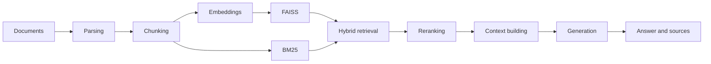

Forked from https://github.com/weiwill88/Local_Pdf_Chat_RAG.

# RecallMCP

A local-first retrieval-augmented generation service: a FastAPI API over
pluggable embeddings (sentence-transformers, or deterministic feature
hashing for tests and demos), FAISS + BM25 hybrid retrieval and
cross-encoder reranking. Everything runs on CPU with no paid API keys;
hosted LLM providers are optional and configured through environment
variables. A retrieval evaluation suite and an MCP server for agents are
being built on this base.

[](https://github.com/vipul21435/recallmcp/actions/workflows/ci.yml)
[](LICENSE)
[](https://www.python.org/)

This repository is a fork of
[weiwill88/Local_Pdf_Chat_RAG](https://github.com/weiwill88/Local_Pdf_Chat_RAG)
(MIT, Will Wei), an educational RAG reference implementation. The upstream
pipeline (document loading, chunking, embeddings, FAISS, BM25, hybrid merge,
reranking, generation) is kept and reworked into a service that is measured
rather than demoed: the Gradio UI is gone, the API is the only interface.
See [CHANGELOG.md](CHANGELOG.md) for the full list of changes relative to
upstream.

## What I built on top

- The `ragsvc` package under `src/` with an application factory
  (`create_app(settings)`), typed and validated `RAG_` settings
  (pydantic-settings) and the `recallmcp` CLI.
- Local-first providers: a running Ollama is auto-detected, any
  OpenAI-compatible endpoint works behind environment variables, and no
  paid API is needed to run or test the service.
- Pluggable embedding providers behind one protocol
  (`ragsvc.embeddings`): sentence-transformers in production and a
  deterministic feature-hashing embedder (word unigrams and bigrams,
  L2-normalised, no model download) that the tests and the demo use, plus
  an SQLite embedding cache keyed by provider, model and text hash with
  hit and miss counters.
- Security defaults: loopback bind, CORS allowlist without credentials,
  an upload size cap and an optional bearer token.
- A typed ingestion pipeline with per-file reports; a failed upload keeps
  the previous knowledge base and concurrent uploads are serialized, with
  new indexes swapped in as a snapshot.
- Structured `/api/ask` responses: sources from retrieval metadata, model
  reasoning as a separate field, `409` for an empty knowledge base and
  `502` for provider failures.
- BM25 tokenization with a regex instead of jieba; English-only code,
  prompts and docs.
- Ruff, strict mypy, pre-commit and GitHub Actions CI; tests run without
  network access, model downloads or credentials (the suite uses the hash
  embedder throughout).

## Pipeline



## Quick start

Requires [uv](https://docs.astral.sh/uv/). `uv sync` installs Python 3.12
and the locked dependencies into `.venv`; torch is resolved from the PyTorch
CPU index on Linux so no CUDA wheels are downloaded.

```bash
git clone https://github.com/vipul21435/recallmcp.git
cd recallmcp

uv sync                    # runtime dependencies
uv sync --extra documents  # also install DOCX / PPTX / Excel parsers
cp .env.example .env       # optional: pick an LLM provider or tune retrieval

uv run recallmcp           # or: uv run python -m ragsvc
```

The API listens on `127.0.0.1` and the first free port in `17995-17999`
(`RAG_API_HOST`, `RAG_API_PORT`). Main endpoints:

- `GET /health`: liveness plus the version, the LLM, embedding and
  reranker provider names, the index size and the embedding cache's hit and
  miss counters; it never loads a model. `GET /ready` answers `200` once
  documents are indexed and `503` before. Neither needs the API token;
- `GET /api/status`: runtime and provider configuration status;
- `POST /api/upload`: upload a document (PDF, TXT, Markdown; DOCX, PPTX and
  XLS/XLSX with the `documents` extra) and rebuild the indexes from it.
  Other formats get `415`; a document that yields no text is reported with
  `status: error` and leaves the previous knowledge base in place;
- `POST /api/ask`: ask a question against the indexed documents
  (`{"question": "...", "provider": "ollama" | "openai" | null}`); answers
  are plain text and carry the source documents, whether the sources
  disagree, and the reasoning of thinking models (`<think>` blocks) as a
  separate `reasoning` field.

Embedding and reranking models are downloaded from the Hugging Face Hub on
first use and cached locally; set `RAG_EMBEDDING_PROVIDER=hash` to run
fully offline with deterministic (lexical, not semantic) embeddings.
Answer generation needs an LLM: a local
[Ollama](https://ollama.com/) server is used when one is running, otherwise
any OpenAI-compatible endpoint configured through `RAG_OPENAI_*`. Without either,
upload and retrieval work and `/api/ask` returns `502` with a clear message.

## Configuration

Settings are typed and validated on startup (`ragsvc.config.Settings`,
built on pydantic-settings). They are read from `RAG_`-prefixed environment
variables and, below them, from a `.env` file in the working directory; an
out-of-range value or an unknown provider name stops the server with a
message naming the variable. Every variable is optional; see
[`.env.example`](.env.example) for the full list with defaults.

| Variable | Purpose |
| --- | --- |
| `RAG_LLM_PROVIDER` | Force `ollama` or `openai` instead of auto-detecting |
| `RAG_OLLAMA_BASE_URL`, `RAG_OLLAMA_MODEL` | Local Ollama server and model (`llama3.2`) |
| `RAG_OPENAI_API_KEY`, `RAG_OPENAI_BASE_URL`, `RAG_OPENAI_MODEL` | Any OpenAI-compatible Chat Completions endpoint; the key and base URL are also read from `OPENAI_API_KEY` and `OPENAI_BASE_URL` |
| `RAG_EMBEDDING_PROVIDER` | `sentence-transformers` (default) or `hash` (deterministic feature hashing, no model) |
| `RAG_EMBED_MODEL_NAME` | Sentence-transformers embedding model (`all-MiniLM-L6-v2`) |
| `RAG_HASH_EMBEDDING_DIMENSION` | Vector size of the hash provider (`256`) |
| `RAG_EMBEDDING_CACHE_ENABLED`, `RAG_EMBEDDING_CACHE_PATH` | SQLite embedding cache (`true`, `.cache/recallmcp/embeddings.sqlite3`) |
| `RAG_RERANK_METHOD`, `RAG_RERANK_MODEL_NAME` | `cross_encoder` (default), `llm` or `none`; cross-encoder model |
| `RAG_CHUNK_SIZE`, `RAG_CHUNK_OVERLAP`, `RAG_HYBRID_ALPHA`, `RAG_RETRIEVAL_TOP_K`, `RAG_RERANK_TOP_K`, `RAG_MAX_RETRIEVAL_ITERATIONS` | Retrieval hyperparameters |
| `RAG_SERPAPI_KEY` | Optional web-search credential (also `SERPAPI_KEY`) |
| `RAG_API_HOST`, `RAG_API_PORT` | Bind address (`127.0.0.1`) and port (first free in `17995-17999`) |
| `RAG_CORS_ALLOW_ORIGINS` | Comma-separated browser origins allowed to call the API (none by default) |
| `RAG_MAX_UPLOAD_MB` | Largest document `/api/upload` accepts (`50`) |
| `RAG_API_TOKEN` | When set, every `/api` request needs `Authorization: Bearer <token>` |

### Embeddings

`ragsvc.embeddings.EmbeddingProvider` is the protocol every provider
implements: `embed_documents`, `embed_query`, `dimension`, `name` and
`model_name`. Two providers ship:

- `sentence-transformers` (default): a neural model from the Hugging Face
  Hub, imported and loaded on first use so that importing the package and
  building the app stay cheap.
- `hash`: feature hashing of word unigrams and bigrams into a fixed-size
  L2-normalised vector. It needs no model, gives identical vectors on every
  machine and is what the test suite and the demo use. It matches on shared
  words, not meaning, so keep it out of production retrieval.

Vectors are kept in an SQLite cache keyed by `(provider, model,
sha256(text))`, so re-indexing an unchanged document embeds nothing and
switching models never serves stale vectors. `GET /health` reports the
cache's hit and miss counters.

## Exposing the API

The defaults keep the service private to the machine it runs on: it binds
the loopback interface, sends no CORS headers (so a web page on another
origin cannot read answers or replace the knowledge base through the
operator's browser), and caps uploads at `RAG_MAX_UPLOAD_MB`. To reach it
from other hosts or a browser front end, set `RAG_API_HOST=0.0.0.0`, list
the front end's origin in `RAG_CORS_ALLOW_ORIGINS`, and set
`RAG_API_TOKEN`; the server logs a warning when it is exposed without a
token. Indexed documents and answers are only as private as whoever can
reach the port, so put a reverse proxy with TLS in front for anything
beyond a trusted network.

## Repository layout

The service is the ``ragsvc`` package under ``src/``, installed in editable
mode by ``uv sync``.

```text
src/ragsvc/
  __init__.py              Package version
  __main__.py              `recallmcp` / `python -m ragsvc`: serve the API
  api.py                   FastAPI application
  config.py                Typed RAG_ settings: providers, models, retrieval, API
  embeddings/
    base.py                EmbeddingProvider protocol and EmbeddingError
    hashing.py             Deterministic feature-hashing embedder (tests, demo)
    sentence_transformer.py  Lazily loaded sentence-transformers embedder
    cache.py               SQLite embedding cache and the cached wrapper
  core/
    document_loader.py     Document text extraction
    text_splitter.py       Text chunking
    embeddings.py          Process-wide embedding provider built from settings
    vector_store.py        FAISS index
    bm25_index.py          BM25 index
    retriever.py           Hybrid and recursive retrieval
    reranker.py            Result reranking
    generator.py           Context building and answer generation
    ingest.py              Ingestion pipeline shared by all entry points
  features/                Web search, conflict detection, reasoning-block splitting
  utils/                   HTTP session and port helpers
tests/                     Tests that need no network access or credentials
```

## Development

```bash
uv sync --all-extras --dev
uv run ruff check . && uv run ruff format --check .   # lint and formatting
uv run mypy                                          # strict type check
uv run pytest                                        # tests
uv run pre-commit install                            # run the checks on every commit
```

Tests run without network access, model downloads or API keys: the
fixtures in `tests/conftest.py` install hermetic settings with the hash
embedder and the embedding cache disabled. GitHub Actions runs lint, type
check and tests on every push and pull request.

## Design notes

- The hash embedder is the default for tests and demos rather than a mocked
  model: it exercises the real ingest, index and search path with vectors
  that are identical on every machine, so retrieval assertions can be exact.
- The embedding cache lives in SQLite (one file, standard library only)
  and is keyed by provider and model as well as text, so changing
  `RAG_EMBED_MODEL_NAME` can never serve vectors from the old model.
- `/ready` means "ready to answer questions", so it stays `503` until
  something is indexed; `/health` is the liveness signal and reports
  configuration without touching models or providers.

## Known limitations

- PDF extraction reads the text layer; there is no OCR.
- The indexes live in process memory and are rebuilt on every upload.
- Hosted model and web-search providers send the query to third parties;
  review your data boundary before enabling them.

## Contributing and security

Read [`CONTRIBUTING.md`](CONTRIBUTING.md) and
[`CODE_OF_CONDUCT.md`](CODE_OF_CONDUCT.md) before opening a pull request.
Report vulnerabilities as described in [`SECURITY.md`](SECURITY.md), not in a
public issue.

## License

Released under the [MIT License](LICENSE). The original work is
Copyright (c) 2025-2026 Will Wei; modifications in this fork are released
under the same license.
