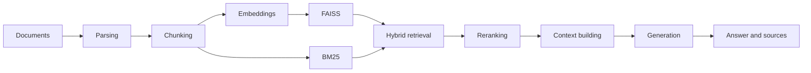

# rag-eval-service

A FastAPI retrieval-augmented generation service with local
sentence-transformers embeddings, FAISS + BM25 hybrid retrieval, and a
retrieval evaluation suite. Everything runs on CPU with no paid API keys;
hosted LLM providers are optional and configured through environment
variables.

[](https://github.com/vipul21435/rag-eval-service/actions/workflows/ci.yml)
[](LICENSE)
[](https://www.python.org/)

This repository is a fork of
[weiwill88/Local_Pdf_Chat_RAG](https://github.com/weiwill88/Local_Pdf_Chat_RAG)
(MIT, Will Wei), an educational RAG reference implementation. The upstream
pipeline (document loading, chunking, embeddings, FAISS, BM25, hybrid merge,
reranking, generation) is kept and reworked into a service that is measured
rather than demoed: the Gradio UI is gone, the API is the only interface, and
retrieval quality is tracked by an evaluation suite. See
[CHANGELOG.md](CHANGELOG.md) for what changed relative to upstream.

## Pipeline



## Quick start

Requires [uv](https://docs.astral.sh/uv/). `uv sync` installs Python 3.12
and the locked dependencies into `.venv`; torch is resolved from the PyTorch
CPU index on Linux so no CUDA wheels are downloaded.

```bash
git clone https://github.com/vipul21435/rag-eval-service.git
cd rag-eval-service

uv sync                    # runtime dependencies
uv sync --extra documents  # also install DOCX / PPTX / Excel parsers
cp example.env .env        # optional: configure a model backend

uv run python api_router.py
```

The API listens on the first free port in `17995-17999`. Main endpoints:

- `GET /api/status`: runtime and provider configuration status;
- `POST /api/upload`: upload a document (PDF, TXT, Markdown; DOCX, PPTX and
  XLS/XLSX with the `documents` extra) and rebuild the indexes from it;
- `POST /api/ask`: ask a question against the indexed documents.

Embedding and reranking models are downloaded from the Hugging Face Hub on
first use and cached locally.

## Configuration

See [`example.env`](example.env) for the complete example. Common variables:

| Variable | Purpose |
| --- | --- |
| `SILICONFLOW_API_KEY` | SiliconFlow API credential |
| `SILICONFLOW_MODEL_NAME` | SiliconFlow model ID |
| `MAGICK_API_KEY` | OpenAI-compatible provider credential |
| `MAGICK_API_URL` | Provider base URL or full Chat Completions URL |
| `MAGICK_MODEL_NAME` | Provider model ID |
| `OLLAMA_MODEL_NAME` | Local Ollama model name |
| `SERPAPI_KEY` | Optional web-search credential |
| `RERANK_METHOD` | `cross_encoder` or `llm` |

## Repository layout

```text
config.py                  Environment, model and retrieval settings
api_router.py              FastAPI application
version.py                 Single source of the package version
core/
  document_loader.py       Document text extraction
  text_splitter.py         Text chunking
  embeddings.py            Sentence-transformers embeddings
  vector_store.py          FAISS index
  bm25_index.py            BM25 index
  retriever.py             Hybrid and recursive retrieval
  reranker.py              Result reranking
  generator.py             Context building and answer generation
  ingest.py                Ingestion pipeline shared by all entry points
features/                  Web search, conflict detection, thinking-chain formatting
utils/                     HTTP session and port helpers
tests/                     Tests that need no network access or credentials
```

## Development

```bash
uv sync --all-extras --dev
uv run pytest
```

Tests run without network access, model downloads or API keys. GitHub
Actions runs the suite on every push and pull request.

## Known limitations

- PDF extraction reads the text layer; there is no OCR.
- The indexes live in process memory and are rebuilt on every upload.
- Hosted model and web-search providers send the query to third parties;
  review your data boundary before enabling them.

## Contributing and security

Read [`CONTRIBUTING.md`](CONTRIBUTING.md) and
[`CODE_OF_CONDUCT.md`](CODE_OF_CONDUCT.md) before opening a pull request.
Report vulnerabilities as described in [`SECURITY.md`](SECURITY.md), not in a
public issue.

## License

Released under the [MIT License](LICENSE). The original work is
Copyright (c) 2025-2026 Will Wei; modifications in this fork are released
under the same license.
